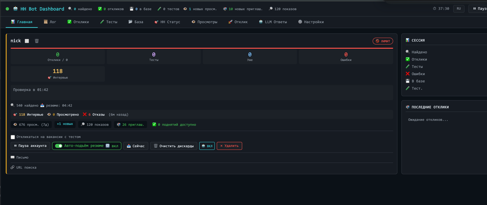
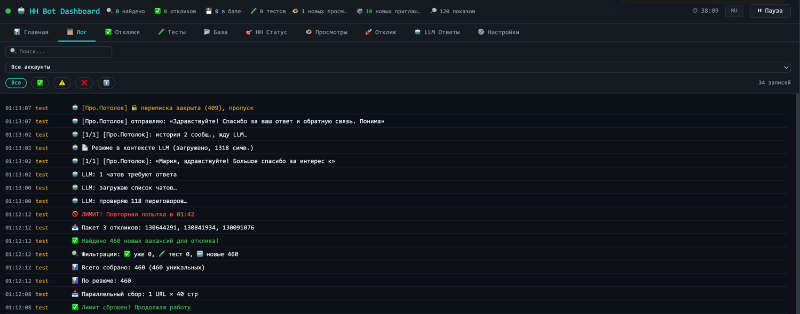
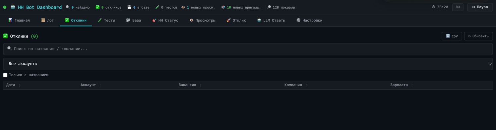
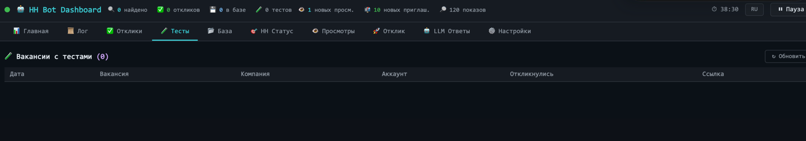
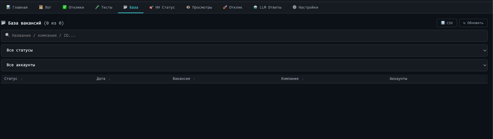
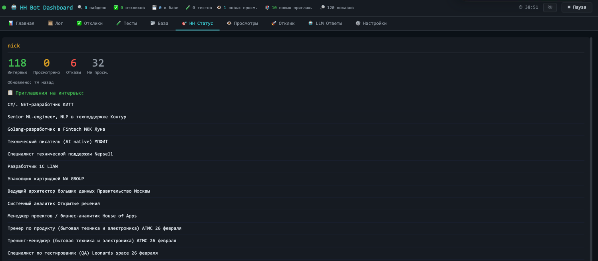
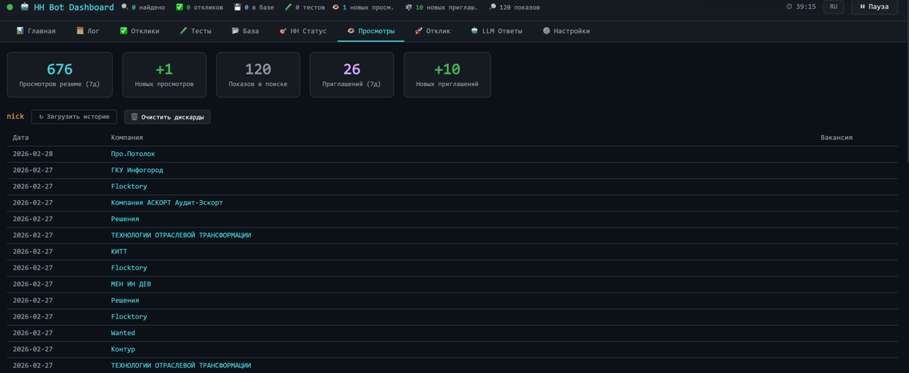
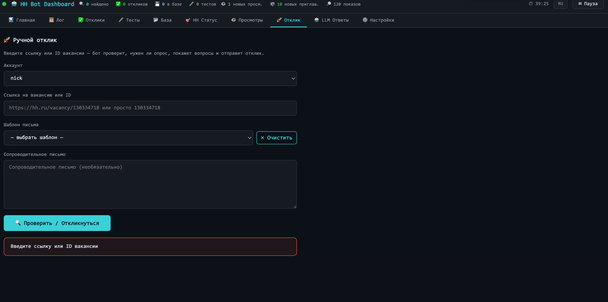
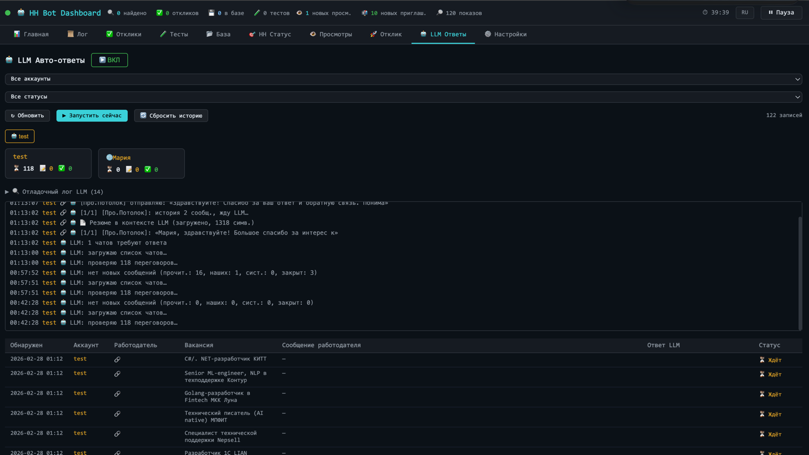
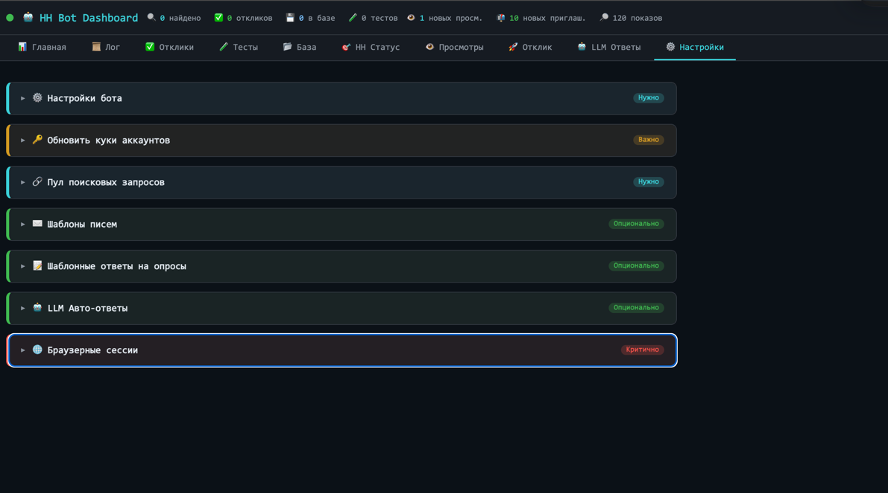

# HH Bot Dashboard

Веб-интерфейс для автоматизации работы с hh.ru: массовые отклики, авто-подъём резюме, мониторинг просмотров, AI-ответы работодателям.

## Скриншоты

### Главная — карточки аккаунтов



Центральный экран управления. На каждой карточке аккаунта:
- Статистика: откликов, вакансий в базе, пройденных тестов
- Тумблер **Авто-подъём резюме** — включить/выключить автоматическое поднятие резюме в поиске
- Кнопка **Сейчас** — немедленный подъём резюме вне расписания
- Текущее активное резюме и его хэш
- Боковая панель сессий (активные / временные аккаунты)

---

### Лог — журнал событий



Живой лог всех действий бота в реальном времени:
- Решения LLM (с объяснением причины отклика)
- Системные события (подъём резюме, смена аккаунта, таймауты)
- Обновление каждую секунду по WebSocket

---

### Отклики — история поданных заявок



Таблица всех поданных откликов с фильтрацией:
- По статусу (просмотрено, приглашение, отказ и т.д.)
- По аккаунту
- Поиск по названию вакансии / компании / ID
- Экспорт в CSV

---

### Тесты — управление ответами на тесты



Просмотр и редактирование сохранённых ответов на тесты работодателей, которые бот проходит автоматически.

---

### База — база вакансий



Локальная база собранных вакансий:
- Фильтрация по статусу и аккаунту
- Поиск по названию / компании / ID
- Сортировка по дате, вакансии, компании
- Экспорт в CSV

---

### HH Статус — переговоры



Список всех переговоров с работодателями напрямую с hh.ru:
- Отображение последних сообщений
- Клик по строке → переход прямо в чат на hh.ru
- Выделение новых/активных переговоров

---

### Просмотры — статистика резюме



Аналитика просмотров резюме:
- **Просмотров за 7 дней**, **новых просмотров**, **показов в поиске**
- **Приглашений за 7 дней** и **новых приглашений**
- История просмотров по компаниям с датами
- Обновление по запросу (кнопка "Загрузить историю")

---

### Ручной отклик



Ручная подача отклика на конкретную вакансию:
- Вставить ссылку на вакансию с hh.ru
- Выбрать аккаунт и резюме
- Опционально — сопроводительное письмо через LLM

---

### LLM Авто-ответы



Автоматические ответы работодателям с помощью GPT:
- Просмотр входящих сообщений
- Генерация и отправка ответов в один клик
- История переписки

---

### Настройки



Тонкая настройка поведения бота:
- Приоритеты поиска вакансий (секции сворачиваются)
- Фильтры по зарплате, опыту, графику
- Параметры авто-подъёма резюме и интервалов

---

## Быстрый старт

### Локально (Python)

```bash
# Клонировать и установить зависимости
git clone <repo>
cd hh.ru-clicker
python -m venv .venv
source .venv/bin/activate
pip install -r requirements.txt

# Запустить
python web_app.py
```

Открыть в браузере: http://localhost:8000

### Docker

```bash
docker-compose up -d
```

Данные сессий сохраняются в `./data/` (монтируется как volume).

---

## Структура данных

```
data/
  browser_sessions.json   # сохранённые аккаунты и cookies
  accounts.json           # конфигурация аккаунтов
```

Формат сессии в `browser_sessions.json`:
```json
{
  "name": "nick",
  "short": "n",
  "color": "yellow",
  "resume_hash": "...",
  "all_resumes": [...],
  "letter": "",
  "cookies": { "hhtoken": "...", ... },
  "bot_active": true,
  "apply_tests": false
}
```

---

## Технологии

| Компонент | Стек |
|-----------|------|
| Backend | Python 3.13, FastAPI, uvicorn |
| Frontend | Vanilla JS, WebSocket (real-time) |
| AI | OpenAI GPT (авто-ответы, решения об откликах) |
| Парсинг | requests, BeautifulSoup4, SSR JSON |
| Деплой | Docker + docker-compose |

---

## Требования

- Python 3.10+
- Cookies активной сессии hh.ru (hhtoken, hhuid, _xsrf и др.)
- OpenAI API ключ (для LLM-функций)
