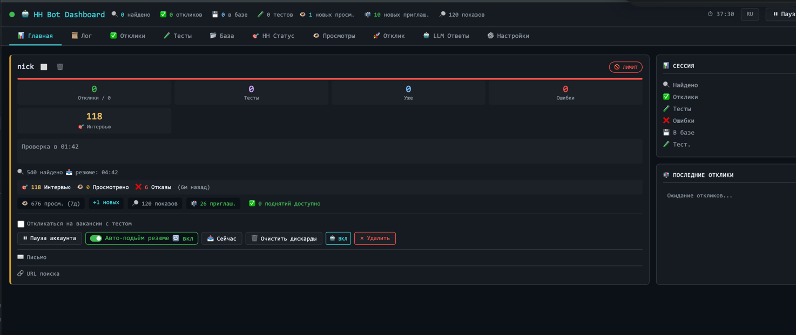
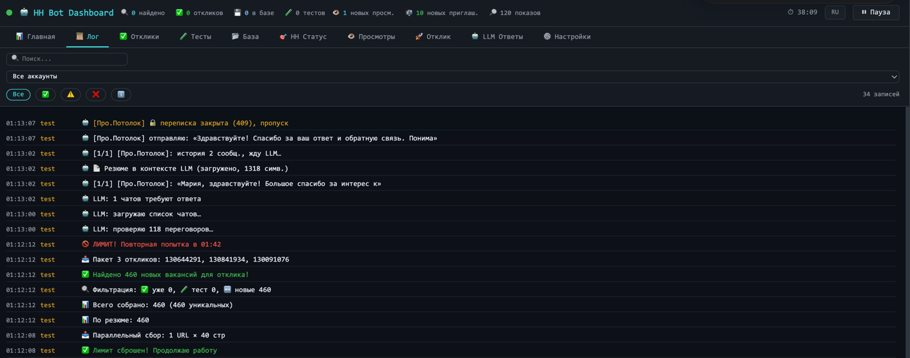
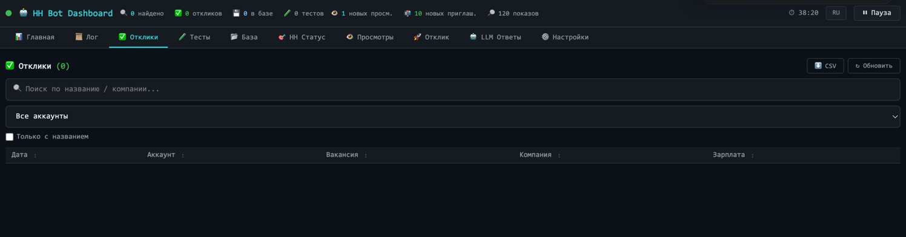
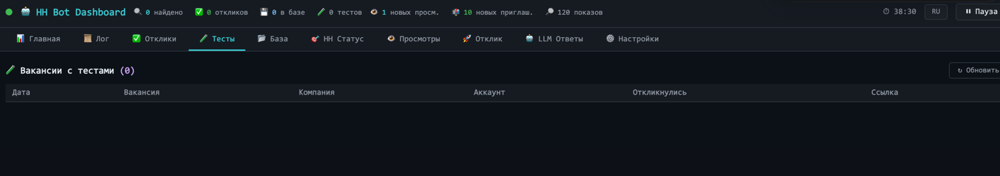
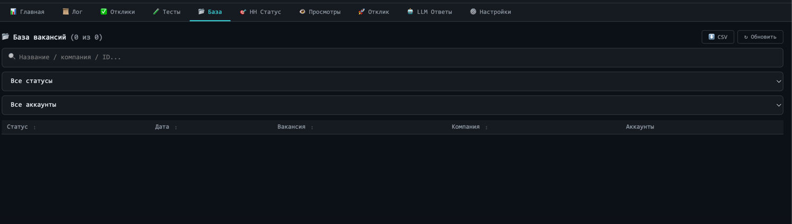
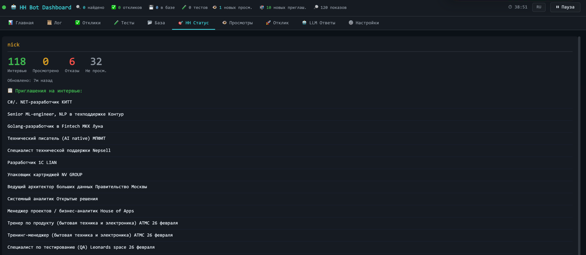
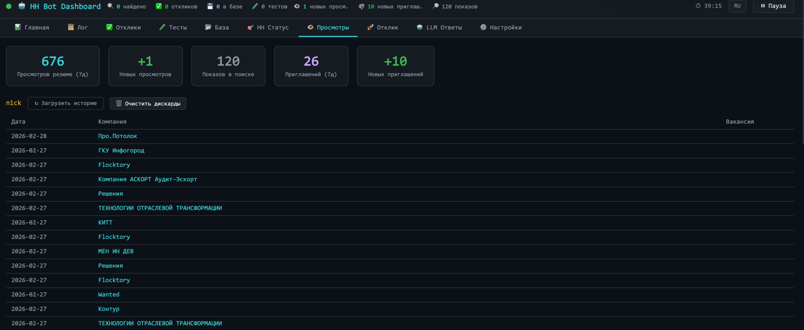
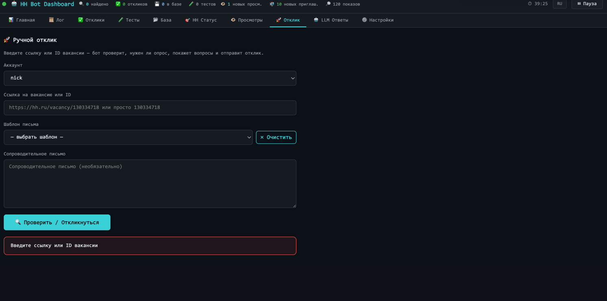
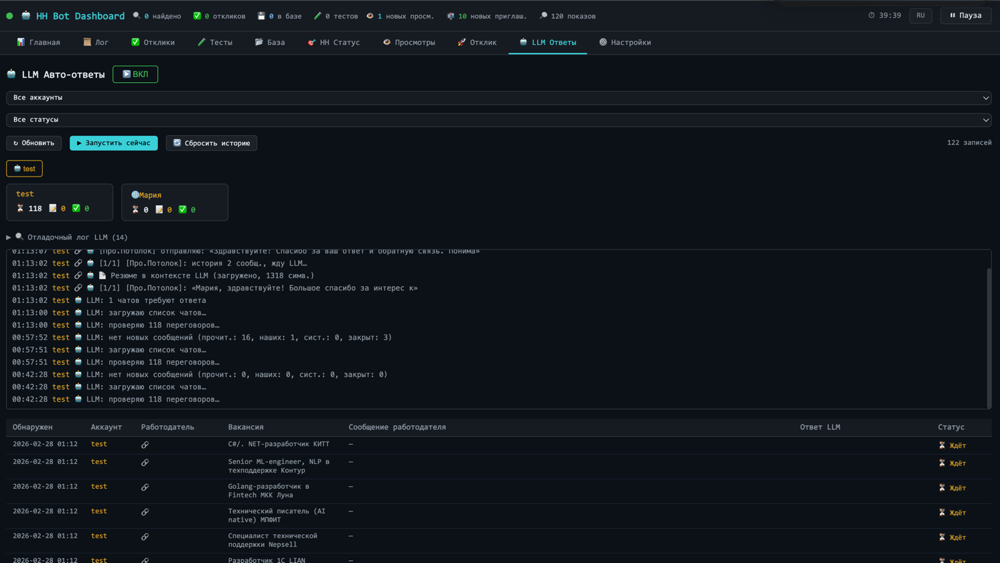
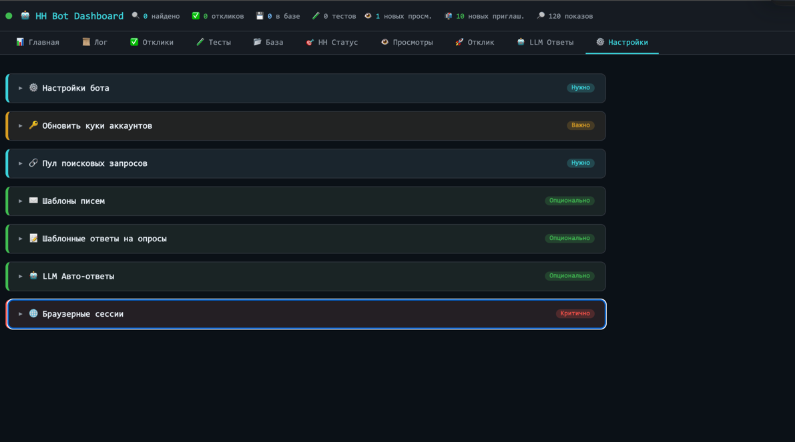

# Панель управления HH Bot

Веб-интерфейс для автоматизации работы с hh.ru: массовые отклики, авто-подъём резюме, мониторинг просмотров, AI-ответы работодателям.

## Скриншоты

### Главная — карточки аккаунтов



Центральный экран управления. На каждой карточке аккаунта:
- Статистика: откликов, вакансий в базе, пройденных тестов
- Тумблер **Авто-подъём резюме** — включить/выключить автоматическое поднятие резюме в поиске
- Кнопка **Сейчас** — немедленный подъём резюме вне расписания
- Текущее активное резюме и его хэш
- Боковая панель сессий (активные / временные аккаунты)

---

### Лог — журнал событий



Живой лог всех действий бота в реальном времени:
- Решения LLM (с объяснением причины отклика)
- Системные события (подъём резюме, смена аккаунта, таймауты)
- Обновление каждую секунду по WebSocket

---

### Отклики — история поданных заявок



Таблица всех поданных откликов с фильтрацией:
- По статусу (просмотрено, приглашение, отказ и т.д.)
- По аккаунту
- Поиск по названию вакансии / компании / ID
- Экспорт в CSV

---

### Тесты — управление ответами на тесты



Просмотр и редактирование сохранённых ответов на тесты работодателей, которые бот проходит автоматически.

---

### База — база вакансий



Локальная база собранных вакансий:
- Фильтрация по статусу и аккаунту
- Поиск по названию / компании / ID
- Сортировка по дате, вакансии, компании
- Экспорт в CSV

---

### HH Статус — переговоры



Список всех переговоров с работодателями напрямую с hh.ru:
- Отображение последних сообщений
- Клик по строке → переход прямо в чат на hh.ru
- Выделение новых/активных переговоров

---

### Просмотры — статистика резюме



Аналитика просмотров резюме:
- **Просмотров за 7 дней**, **новых просмотров**, **показов в поиске**
- **Приглашений за 7 дней** и **новых приглашений**
- История просмотров по компаниям с датами
- Обновление по запросу (кнопка "Загрузить историю")

---

### Ручной отклик



Ручная подача отклика на конкретную вакансию:
- Вставить ссылку на вакансию с hh.ru
- Выбрать аккаунт и резюме
- Опционально — сопроводительное письмо через LLM

---

### LLM Авто-ответы



Автоматические ответы работодателям с помощью GPT:
- Просмотр входящих сообщений
- Генерация и отправка ответов в один клик
- История переписки

---

### Настройки



Тонкая настройка поведения бота:
- Приоритеты поиска вакансий (секции сворачиваются)
- Фильтры по зарплате, опыту, графику
- Параметры авто-подъёма резюме и интервалов

---

## Быстрый старт

### Локально (Python)

```bash
# Клонировать и установить зависимости
git clone <repo>
cd hh.ru-clicker
python -m venv .venv
source .venv/bin/activate
pip install -r requirements.txt

# Запустить
python web_app.py
```

Открыть в браузере: http://localhost:8000

### Docker

```bash
docker-compose up -d
```

Данные сессий сохраняются в `./data/` (монтируется как том Docker).

---

## Структура данных

```
data/
  accounts.json                 # основные аккаунты панели; может быть пустым массивом
  browser_sessions.json         # браузерные сессии, cookies, резюме и настройки аккаунта
  config.json                   # глобальные настройки бота, URL-пул, шаблоны писем, LLM и анкеты
  applied_vacancies.json        # история отправленных откликов по аккаунтам и ID вакансий
  test_required_vacancies.json  # вакансии, где потребовался тест или анкета
  answer_history.json           # история ответов на тесты/анкеты работодателей
  interviews.json               # переговоры, сообщения, статусы LLM-ответов и закрытые чаты
  debug.log                     # рабочий лог серверной части
```

Основные форматы:

`browser_sessions.json` и элементы `accounts.json`:
```json
{
  "name": "nick",
  "short": "n",
  "color": "yellow",
  "resume_hash": "...",
  "all_resumes": [...],
  "letter": "",
  "cookies": { "hhtoken": "...", ... },
  "bot_active": true,
  "url_pages": {},
  "apply_tests": false
}
```

`config.json`:
```json
{
  "pages_per_url": 25,
  "max_concurrent": 20,
  "response_delay": 3,
  "pause_between_cycles": 60,
  "min_salary": 0,
  "questionnaire_templates": [{ "keywords": ["..."], "answer": "..." }],
  "letter_templates": [{ "name": "Стандартное", "text": "..." }],
  "url_pool": [{ "url": "https://hh.ru/search/vacancy?...", "pages": 25 }],
  "llm_enabled": false,
  "llm_profiles": [{ "name": "gpt", "base_url": "https://api.openai.com/v1", "model": "gpt-4o-mini" }]
}
```

`applied_vacancies.json`:
```json
{
  "Имя аккаунта": {
    "123456789": {
      "url": "https://hh.ru/vacancy/123456789",
      "title": "Название вакансии",
      "company": "Компания",
      "salary_from": null,
      "salary_to": null,
      "at": "2026-04-04T05:18:28.422961"
    }
  }
}
```

`test_required_vacancies.json` хранит вакансии, где отклик упёрся в тест; `answer_history.json` - сохранённые ответы на вопросы тестов; `interviews.json` - переговоры и служебные признаки LLM-автоответов.

---

## Структура файлов

```
.
  web_app.py                 # точка входа приложения; импортирует модули серверной части
  requirements.txt           # Python-зависимости
  Dockerfile                 # образ приложения
  docker-compose.yml         # локальный запуск в контейнере с томом для data/
  README.md                  # основная документация проекта

  hh_backend/
    __init__.py              # пакет серверной части
    README.md                # краткая карта модулей серверной части
    state.py                 # глобальная конфигурация и список аккаунтов
    storage.py               # чтение/запись JSON, кеши, функции доступа к данным
    hh_client.py             # HTTP-клиент HH.ru, парсинг страниц, резюме, чаты и LLM
    bot.py                   # состояние аккаунтов, рабочие циклы бота и WebSocket-рассылка
    routes.py                # маршруты FastAPI, обработчики REST API, WebSocket-точка подключения и служебные точки доступа

  static/
    index.html               # HTML-разметка панели
    css/dashboard.css        # стили интерфейса
    js/dashboard.js          # клиентская логика, WebSocket, рендер таблиц и настроек

  data/                      # рабочие JSON-данные, сессии, история и логи
  images/                    # скриншоты интерфейса для README
```

---

## Технологии

| Компонент | Стек |
|-----------|------|
| Серверная часть | Python 3.13, FastAPI, uvicorn |
| Интерфейс | Vanilla JS, WebSocket (реальное время) |
| AI | OpenAI GPT (авто-ответы, решения об откликах) |
| Парсинг | requests, BeautifulSoup4, SSR JSON |
| Деплой | Docker + docker-compose |

---

## Требования

- Python 3.10+
- Cookies активной сессии hh.ru (hhtoken, hhuid, _xsrf и др.)
- OpenAI API ключ (для LLM-функций)
