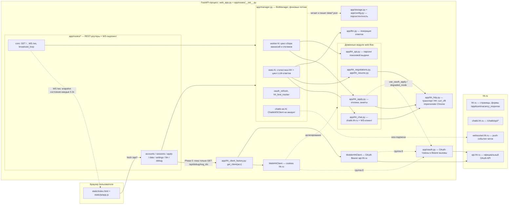
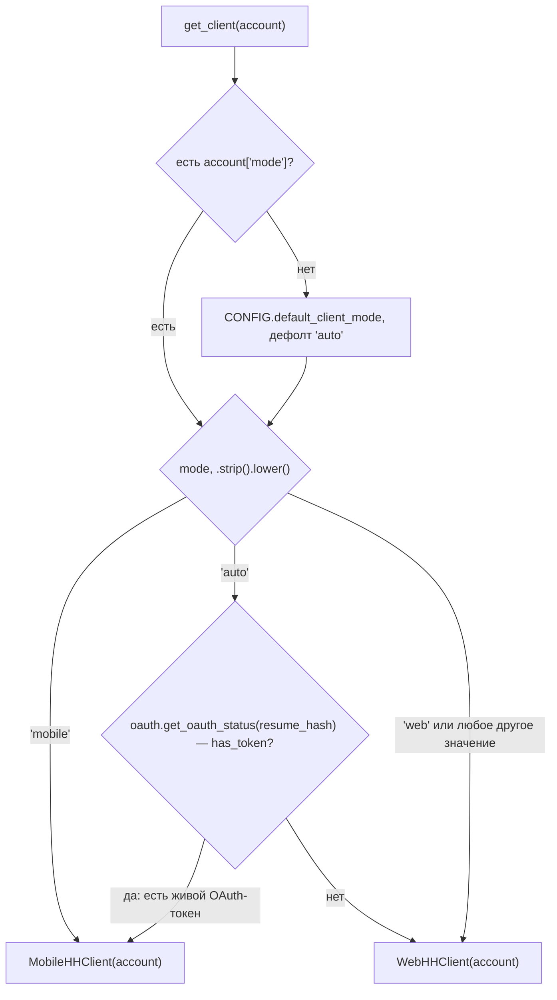
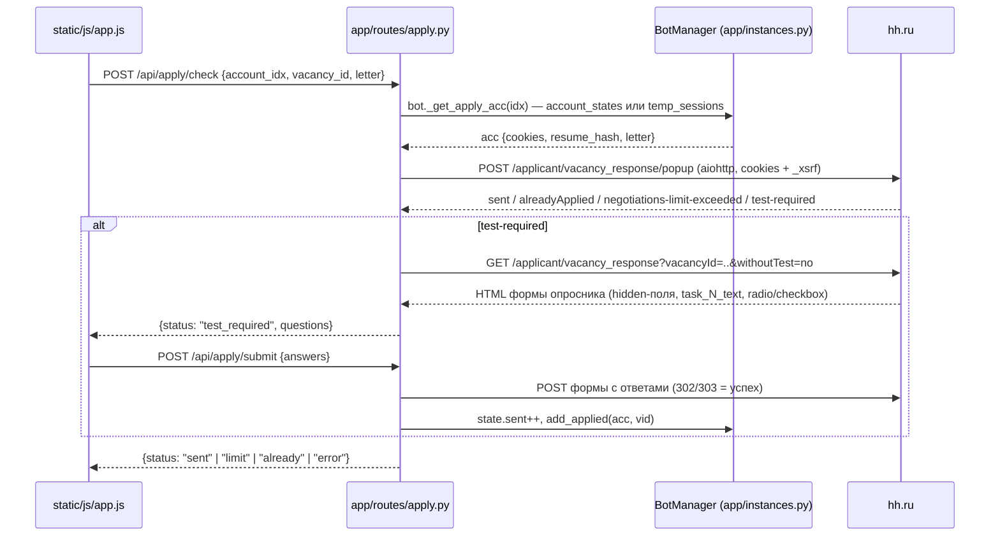
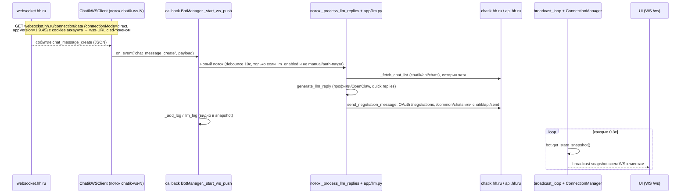

# Архитектура hh.ru-clicker (рефакторинг mobile-api)

Документ описывает текущее состояние проекта на ветке `refactor/mobile-api`
(HEAD = `b3bba5a` = `origin/main` + uncommitted файлы Phase 0:
`app/hh_client*.py`, `app/hh_client_factory.py`, изменённые `app/config.py`,
`app/routes/debug.py`, тест `tests/test_hh_client_abstraction.py`).

hh.ru-clicker — FastAPI web-дашборд (`web_app.py`) для автоматизации hh.ru:
массовые отклики на вакансии, LLM-ответы HR через push-канал
`websocket.hh.ru`, опросники, аудит резюме. Фронт — vanilla JS в `static/`.
Python 3.10+.

---

## 1. Общая схема

### 1.1. Топология

Пунктир помечает: а) делегирование без собственного HTTP (клиент только
подставляет `self.acc` в существующие функции), б) путь, который включается
по флагам, в) миграцию на factory, которая в Phase 0 ещё не завершена
(раздел 5).

### 1.2. Где что живёт

| Компонент | Файлы | Назначение |
|---|---|---|
| Точка входа | `web_app.py` | uvicorn: хост только loopback (`HH_BOT_HOST`, наружу — только с `HH_BOT_UNSAFE_EXPOSE=1`), порт `HH_BOT_PORT` (8000), graceful-shutdown хук (SIGTERM/SIGINT → `bot.stop()` + flush save-executor) |
| FastAPI-приложение | `app/routes/__init__.py` | `lifespan`: загрузка аккаунтов, `bot.start()`, таск `broadcast_loop`; API-key middleware (`HH_BOT_API_KEY`), security headers, `/healthz`; регистрация 8 роутеров |
| Роутеры | `app/routes/{core,accounts,sessions,data,apply,settings,llm,debug}.py` | REST `/api/*` и WS `/ws` |
| Singleton-объекты | `app/instances.py` | `bot = BotManager()`, `manager = ConnectionManager()` — создаются один раз, импортируются всеми роутерами без циклических импортов |
| Фоновые воркеры | `app/manager.py` (`BotManager`) | потоки на аккаунт: `worker-N` (отклики), `stats-N` (статистика + LLM); глобальные: `oauth_refresh` (раз в 6ч proactive refresh токенов с TTL < 48ч), `hh_limit_tracker` (раз в 30 мин сверяет daily-счётчик с HH); `chatik-ws-N` — WS-клиент на аккаунт |
| Состояние аккаунта | `app/state.py` (`AccountState`) | counters, паузы, `degraded_mode`, `cookies_expired`, кэши LLM-черновиков, `hh_*`-статистика |
| Storage | `app/storage.py` + `data/*.json` | `applied_vacancies.json`, `test_required_vacancies.json`, `interviews.json`, `browser_sessions.json`, `events.jsonl`; записи через общий `ThreadPoolExecutor` (`_schedule_save`); плюс `data/config.json`, `data/accounts.json` (`app/config.py`), `data/oauth_tokens.json` (`app/oauth.py`), `data/llm_log.jsonl`, логи `debug.log`/`diag.log` |
| OAuth | `app/oauth.py` | получение/refresh/инвалидация токенов, Bearer-вызовы api.hh.ru (раздел 2.4) |
| LLM | `app/llm.py` | `generate_llm_reply` (OpenAI-совместимые профили, fallback/roundrobin, OpenClaw), quick replies, ответы на опросники |
| Чатики | `app/hh_chat.py` | reverse-engineered chatik.hh.ru API + `ChatikWSClient` (push-канал websocket.hh.ru) |
| Отклики | `app/hh_apply.py` | web-flow отклики/опросники (aiohttp, cookies); OAuth-отклик — `app/oauth.py::_oauth_apply` |
| Транспорт | `app/hh_http.py` | singleton `HH` — curl_cffi с impersonate Chrome TLS (`chrome124`) / fallback requests; проксирование `HH_PROXY`; диагностика подозрительных ответов в `data/diag.log` |

> ⚠️ Конфликт имён: `app/hh_http.py::HHClient` (транспортная curl_cffi-обёртка,
> singleton `HH`, к hh-домену отношения не имеет) и `app/hh_client.py::HHClient`
> (доменная абстракция из этого документа). Это разные классы; предупреждение
> зафиксировано в docstring `app/hh_client.py`.

---

## 2. HHClient-абстракция (Phase 0)

Файлы: `app/hh_client.py` (интерфейс), `app/hh_client_web.py`,
`app/hh_client_mobile.py` (реализации), `app/hh_client_factory.py` (выбор).
Принцип: «один клиент — один аккаунт». Конструктор сохраняет account-dict
(`self.acc`); методы `acc` не принимают — реализации сами подставляют его
в существующие hh-функции.

### 2.1. Интерфейс `app/hh_client.py::HHClient` (ABC)

37 абстрактных методов, разбитых на группы:

| Группа | Методы | Что покрывает |
|---|---|---|
| A — переговоры/чат | 14: `fetch_negotiations`, `fetch_thread`, `send_message`, `fetch_chat_list`, `fetch_chat_history`, `fetch_quick_replies`, `send_participant_action`, `mark_chat_read`, `fetch_possible_offers`, `auto_decline_discards`, `fetch_negotiations_metadata`, `fetch_employer_rating`, `fetch_employer_id_for_vacancy`, `fetch_vacancy_owner_hr_hhid` | статистика переговоров, чаты chatik, офферы, rating работодателя (web-scraping) |
| B — отклики | 6: `submit_response` (**async**), `fill_questionnaire` (**async**), `check_vacancy_before_apply`, `check_limit`, `touch_resume`, `fetch_related_vacancies` | отклик + опросники + лимиты + touch резюме |
| C — резюме | 8: `fetch_stats`, `fetch_resume`, `fetch_resume_view_history`, `fetch_resume_views_aggregate`, `analyze_resume`, `edit_resume_field`, `set_job_search_status`, `fetch_account_diagnostics` | текст/статистика/аудит/редактирование резюме |
| D — счётчики | 1: `fetch_counters` | `GET /me?with_user_statuses=true` (есть только у mobile) |
| E — OAuth-extras | 8: `fetch_saved_vacancy_searches`, `fetch_favorited_vacancies`, `fetch_blacklisted_vacancies`, `fetch_vacancy_details`, `fetch_negotiations_today_count`, `fetch_negotiations_statistic`, `fetch_resume_status`, `fetch_employer_rating_oauth` | вызовы api.hh.ru через Bearer, уже реализованные в `app/oauth.py` |

**Контракт по синхронности.** Интерфейс смешанный, как в существующем коде:
35 методов синхронные, два метода группы B — `submit_response` и
`fill_questionnaire` — объявлены `async def` (web-функции
`hh_apply.send_response_async` / `hh_apply.fill_and_submit_questionnaire`
исторически async). Синхронные вызовы из async-роутов уходят в
`run_in_executor` (см. пример в `app/routes/debug.py`). Возвращаемые типы —
как у нижележащих функций: например `send_message` возвращает
`bool | "chat_not_found"`, отклики — кортеж `(result, info)` с
`result ∈ {sent, limit, already, test, auth_error, error}`.

### 2.2. `WebHHClient` — cookies hh.ru + chatik.hh.ru

Чистый адаптер поверх существующего web-flow: ноль новой логики, каждый метод
делегрует в функцию доменного модуля, подставляя `self.acc` первым аргументом:

- группа A → `app/hh_chat.py`, `app/hh_negotiations.py`;
- группа B → `app/hh_apply.py` (async-методы вызываются с `await`);
- группа C → `app/hh_resume.py`;
- группа E → `app/oauth.py` (эти вызовы уже ходят Bearer'ом в api.hh.ru —
  одинаково для web и mobile аккаунтов).

Импортируются именно **модули** (`from app import hh_chat, hh_apply, ...`),
а не функции — чтобы тесты могли monkeypatch'ать атрибуты модулей
(см. `tests/test_hh_client_abstraction.py::test_web_client_delegates_fetch_thread`).

Особенность: `fetch_counters()` в web-клиенте кидает
`NotImplementedError("phase 0: web-клиент не имеет аналога GET /me")` —
у web-flow нет аналога этого mobile-endpoint'а.

### 2.3. `MobileHHClient` — OAuth Bearer через api.hh.ru

Skeleton: в Phase 0 реально реализованы только

- `fetch_counters()` — smoke-test абстракции:
  `GET https://api.hh.ru/me?with_user_statuses=true` с
  `Authorization: Bearer <token>` (токен через
  `app.oauth._obtain_oauth_token(acc)`), UA `hh-clicker/1.0`. Любая ошибка
  (нет токена, не-200, exception) → `{}`. HTTP ходит через библиотеку
  `requests`, а не через транспортный singleton `HH` — сознательно, чтобы
  тесты мокали его через `responses`;
- группа E — делегирование в `app/oauth.py` (те же Bearer-вызовы, что и у
  web-клиента).

Остальные методы кидают `NotImplementedError` с маркером фазы:

| Фаза | Что закрывает |
|---|---|
| phase 2 | группа A — переговоры/чаты |
| phase 3 | группа B — отклики |
| phase 4 | группа C — резюме/статистика |

### 2.4. Ошибки и fallback

Честное состояние Phase 0: **автоматического runtime-fallback'а
mobile → web при ошибке нет.**

- `get_client(acc)` вызывается точечно и возвращает одну реализацию; если
  `MobileHHClient` кидает `NotImplementedError` или получает 401, повторной
  попытки через `WebHHClient` не происходит — ошибка уходит вызывающему
  (например, `GET /api/debug/neg_ids/{idx}` возвращает
  `{"ok": false, "error": ...}`).
- Единственный механизм «fallback» — сам выбор `mode="auto"` в момент вызова
  factory: mobile отдаётся только при живом токене, иначе web (раздел 3).
- На уровне OAuth-слоя есть смежный механизм: при 401/403 от api.hh.ru
  (`_oauth_apply`, `send_chat_message_oauth`, `send_negotiation_message_oauth`)
  вызывается `app.oauth.invalidate_oauth_token(resume_hash, acc)` — кэшированный
  токен удаляется, и **следующий** выбор `mode=auto` вернёт web-клиент
  (`get_oauth_status()["has_token"]` станет `False`). На текущий запрос это
  не влияет.
- Обратное направление (web → OAuth) в существующем коде есть: при протухших
  cookies аккаунт переходит в `degraded_mode`, и воркер откликов форсирует
  OAuth-путь (`manager.py`: `state.use_oauth or CONFIG.use_oauth_apply or
  state.degraded_mode`).

---

## 3. Factory и выбор режима

`app/hh_client_factory.py::get_client(account: dict) -> HHClient`:

Детали реализации:

- `mode = (account.get("mode") or CONFIG.default_client_mode or "auto")`,
  затем `.strip().lower()`; неизвестное значение трактуется как `"web"`
  (последняя ветка — `return WebHHClient(account)`);
- `"auto"` проверяет `oauth.get_oauth_status(account["resume_hash"])["has_token"]`
  — токен жив, пока `expires_at > now` (учитываются и composite-ключи
  `resume_hash::account_key` в `data/oauth_tokens.json`).

### Где хранится `mode`

Схема задокументирована в docstring `app/config.py`:

| Хранилище | Кто пишет | Примечание |
|---|---|---|
| `data/accounts.json` (список account-dict'ов) | `app/config.py::save_accounts()` | отбрасываются только ключи с префиксом `_` (runtime-объекты типа `_cookies_lock`); `mode` сохраняется как есть |
| `data/browser_sessions.json` (temp-сессии) | `app/storage.py::save_browser_sessions()` | такие же account-подобные dict'ы с cookies; при записи удаляются только `_raw_cookie_line`/`raw_cookie_line`. `get_client()` работает с ними без различий |
| `data/config.json` → `CONFIG.default_client_mode` | `app/config.py::save_config()` | дефолт `"auto"`; ключ входит в `_CONFIG_KEYS`, валидируется в `load_config()` (`web`/`mobile`/`auto`, иначе `"auto"`); меняется через `POST /api/settings`, `POST /api/raw/config` или WS-команду `set_config` |

`default_client_mode` используется только когда у аккаунта нет собственного
поля `mode`.

> Задел на будущее: в Phase 0 нет отдельного UI-контрола для `mode` конкретного
> аккаунта — поле выставляется редактированием JSON (в т.ч. через
> `POST /api/raw/accounts`). В `static/js` и роутерах поле пока не
> обрабатывается.

---

## 4. Путь запроса: от UI до hh.ru

### 4.1. Пример 1 — ручной отклик на вакансию (два шага)

Цепочка в коде: JS `fetch` → `app/routes/apply.py::api_apply_check` →
`bot._get_apply_acc(idx)` → `aiohttp.ClientSession(cookies=acc["cookies"],
headers=get_headers(xsrf))` → `POST {hh_base()}/applicant/vacancy_response/popup`
→ классификация ответа (`classify` прямо в роутере: `shortVacancy` → sent,
`negotiations-limit-exceeded` → limit, `alreadyApplied` → already,
`test-required` → парсинг анкеты) → шаг 2 `api_apply_submit` шлёт заполненную
форму.

Обратите внимание: ручной путь идёт `aiohttp` напрямую, минуя и транспортный
`HH` (curl_cffi), и HHClient-абстракцию — это дорефакторинный код.

**Автоотклики в воркере** (`manager.py::_run_account_worker_inner`) выбирают
канал по флагам: `state.use_oauth or CONFIG.use_oauth_apply or
state.degraded_mode` →
`app/oauth.py::_oauth_apply` (`POST https://api.hh.ru/negotiations`,
Bearer; результаты `sent/limit/already/test/auth_error/error`, на 401/403 —
`invalidate_oauth_token`), иначе batch
`app/hh_apply.py::send_response_async` через `asyncio.run`
(`POST /applicant/vacancy_response/popup`, письмо по шаблону либо
HH-AI letter через `POST /shards/hhpro_ai_letter`).

### 4.2. Пример 2 — push из websocket.hh.ru → LLM-ответ → UI

Детали по коду:

- **Подключение.** `manager.py::_start_ws_push(state)` вызывается в `start()`
  для каждого аккаунта и в `activate_session()` для temp-сессий; gated by
  `CONFIG.llm_ws_push_enabled`. `app/hh_chat.py::fetch_chatik_ws_url(acc)`
  делает `GET https://websocket.hh.ru/connection/data?connectionMode=direct&appVersion=1.9.45`
  с HH-куками и получает `{"url": "wss://websocket.hh.ru/ws/connect?sd=<auth>"}`
  (auth вшит в `sd`, отдельной подписки нет).
- **Клиент.** `ChatikWSClient` — поток на `websocket-client.WebSocketApp`:
  ping каждые 180с, reconnect с backoff 2с + 0.5с/попытка (потолок 30с,
  максимум 120 попыток). События парсятся из `msg.type` / `msg.event` /
  первого ключа: `chat_message_create`, `chat_message_edited`,
  `chat_message_deleted`, `chat_state_changed`, `last_viewed_message_change`,
  `chat_participant_action`, `connect`/`disconnect`.
- **Обработка.** В callback'е `_start_ws_push`: `chat_message_create` →
  debounce 10с на аккаунт, проверка `CONFIG.llm_enabled`, `state.llm_enabled`
  и пауз (блокируют только global/manual/auth — HH-limit пауза чаты не
  останавливает) → поток `_process_llm_replies(state)`. Тот загружает
  `_fetch_chat_list(acc, max_pages=3)` (chatik.hh.ru), отбирает кандидатов
  (NEGOTIATION, непрочитанные, от работодателя, не DISCARD, не заблокированные),
  берёт историю (`_fetch_chat_history` либо OAuth
  `fetch_negotiation_messages_oauth`), генерирует ответ
  (`app/llm.py::generate_llm_reply`) и отправляет через
  `app/hh_chat.py::send_negotiation_message`. Выбор канала происходит
  **внутри** этой функции: при `CONFIG.chat_use_oauth` или мёртвых cookies
  (нет `hhtoken`) сначала пробуется официальный OAuth-путь —
  `POST api.hh.ru/negotiations/{neg_id}/messages`, при неудаче
  `POST api.hh.ru/common/chats/{chat_id}/messages` (`is_automated: true`);
  на любую ошибку OAuth — fallback на reverse-engineered
  `POST chatik.hh.ru/chatik/api/send`.
  `chat_message_edited` сбрасывает кэш LLM-черновиков по чату,
  `last_viewed_message_change` пишет в лог «HR прочитал».
- **Доставка в UI.** Прямого relay событий нет: UI получает состояние через
  `broadcast_loop` (asyncio-таск из lifespan) — каждые 0.3с
  `bot.get_state_snapshot()` рассылается всем подключённым WS-клиентам через
  `app/websocket.py::ConnectionManager.broadcast` (параллельная отправка
  `asyncio.gather`, таймаут 3с на сокет, мёртвые сокеты дропаются).
  События push-канала доезжают до браузера как часть лога/счётчиков в
  snapshot'е.

---

## 5. Эволюция архитектуры

**Было (main до Phase 0).** Все потоки обращались к hh.ru напрямую через
доменные модули: `hh_apply`/`hh_chat`/`hh_negotiations`/`hh_resume`
импортируются в `manager.py` и роутерах как функции первого класса
(аккаунт передаётся первым аргументом, cookies живут в `acc["cookies"]`).
OAuth-канал существовал как точечный второй путь: `_oauth_apply` /
`_oauth_touch_resume` / extras в `app/oauth.py`, включаемые флагами
`use_oauth_apply`, `state.use_oauth`, `chat_use_oauth` и `degraded_mode`.

**Стало (Phase 0, текущий worktree).** Введена доменная абстракция
`HHClient` с двумя реализациями (web/mobile) и factory `get_client(acc)`
с per-account полем `mode`. Логика не мигрировала: `WebHHClient` — адаптер
к тем же функциям, `MobileHHClient` — skeleton с заглушками по фазам
(2 — чаты, 3 — отклики, 4 — резюме). Единственный потребитель factory сейчас —
`GET /api/debug/neg_ids/{idx}` (`app/routes/debug.py`), что позволяет
обкатать выбор клиента без риска для основных потоков.

**Ветка `pr20`** (`git log origin/main..pr20`, 13 коммитов) — параллельная
работа над mobile-аутентификацией: OTP-auth и конфигурация (`076d238`),
мобильные User-Agent'ы, Android-вариант resume-endpoint'а, OAuth
publishability, фиксы chatik/UA/mobile_auth. Это фундамент для заполнения
заглушек `MobileHHClient` в фазах 2–4.

**Целевое состояние.** Воркеры `manager.py` и роутеры вызывают методы
`HHClient` через factory вместо прямых импортов доменных функций; канал
(web/mobile) выбирается по `mode` аккаунта; mobile-реализация покрывает
группы A–C через api.hh.ru.

### Известные несоответствия и заделы (Phase 0)

1. `mode` читается factory, но UI-контрола для него нет — только ручная правка
   `data/accounts.json` / `data/browser_sessions.json` или `POST /api/raw/accounts`.
2. Factory используется одним debug-эндпоинтом; основные потоки (`manager.py`,
   `routes/apply.py` и др.) по-прежнему вызывают модульные функции напрямую.
3. Runtime-fallback mobile → web отсутствует (раздел 2.4) — только выбор в
   `mode=auto` и отложенный эффект `invalidate_oauth_token`.
4. `MobileHHClient.fetch_counters` ходит «чистым» `requests` мимо `HH`
   (curl_cffi/proxy/diag) — сознательно ради mock'а в тестах.
5. Два класса `HHClient` (`app/hh_client.py` vs `app/hh_http.py`) — не путать.
6. Ручные `/api/apply/*` используют aiohttp напрямую, минуя транспорт `HH`.

---

## 6. Справочник модулей

| Модуль | Ключевые сущности |
|---|---|
| `web_app.py` | запуск uvicorn, host/port env, shutdown-хук |
| `app/routes/__init__.py` | FastAPI, lifespan, middleware, роутеры |
| `app/routes/core.py` | `GET /`, `WS /ws`, `POST /api/pause`, `broadcast_loop` |
| `app/routes/accounts.py` | карточка аккаунта: паузы, cookies, OAuth-статус, резюме, переговоры (`GET /api/negotiations/{idx}`), decline_discards |
| `app/routes/apply.py` | ручной отклик: `POST /api/apply/check`, `POST /api/apply/submit` |
| `app/routes/debug.py` | диагностика, proxy, `GET /api/debug/neg_ids/{idx}` (единственный потребитель factory) |
| `app/manager.py` | `BotManager`: воркеры, snapshot, LLM-цикл, WS-push |
| `app/instances.py` | singleton `bot`, `manager` |
| `app/state.py` | `AccountState` |
| `app/config.py` | `CONFIG`, `accounts_data`, save/load, `hh_base()`/`hh_url()`, схема `mode` |
| `app/storage.py` | персистентные кэши и сессии, `_schedule_save` |
| `app/oauth.py` | токены (`data/oauth_tokens.json`), `_obtain_oauth_token`, `_oauth_apply`, extras |
| `app/hh_client.py` / `_web` / `_mobile` / `_factory` | абстракция Phase 0 (раздел 2) |
| `app/hh_apply.py` | `send_response_async`, `fill_and_submit_questionnaire`, `check_limit`, `touch_resume`, `fetch_related_vacancies` |
| `app/hh_chat.py` | chatik API (`_fetch_chat_list`, `_fetch_chat_history`, `send_negotiation_message`, quick replies, mark_read) + `ChatikWSClient` |
| `app/hh_negotiations.py` | `fetch_hh_negotiations_stats`, possible offers, employer rating (web) |
| `app/hh_resume.py` | резюме: текст, статистика, просмотры, SSR-парсинг |
| `app/hh_api.py` | заголовки/парсинг поисковой выдачи hh.ru |
| `app/llm.py` | `generate_llm_reply`, профили, OpenClaw, ответы на опросники |
| `app/websocket.py` | `ConnectionManager.broadcast` — рассылка snapshot'ов в UI |
| `app/hh_http.py` | транспорт `HH`: curl_cffi impersonate, прокси, diag-лог |
