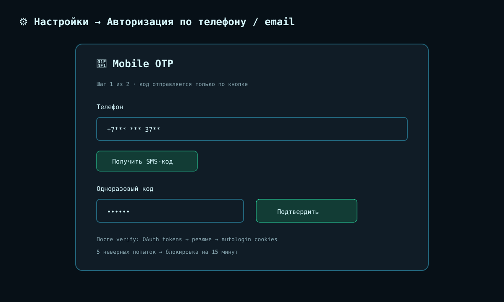

# Mobile Migration Guide

Практический переход аккаунта с browser cookies на OAuth/mobile API.

## Перед началом

Нужны существующий аккаунт hh.ru с телефоном или email, хотя бы одно резюме и
доступ к SMS/почте. Сделайте защищённую копию каталога `data/`; она содержит
секреты. Mobile-режим не регистрирует новый аккаунт.

## Переход

1. Запустите dashboard и откройте **Настройки → Авторизация по телефону / email**.
2. Запросите код один раз. При CAPTCHA пройдите проверку по URL от HH, затем
   запросите новый код без циклических повторов.
3. Введите OTP и дождитесь завершения verify. Запрос синхронно получает `/me` и
   резюме, сохраняет OAuth и создаёт cookies через autologin, поэтому может
   выполняться несколько минут.
4. Убедитесь, что нужное резюме появилось и связано с OAuth-токеном.
5. Выберите режим `auto` (рекомендуется) или `mobile` для каждого аккаунта.
6. Проверьте counters, список переговоров и один ручной отклик до включения
   массовой автоматизации.



## Почему `mode="mobile"` иногда не работает

- Токен хранится по identity/resume; ошибочный или устаревший `resume_hash`
  лишает аккаунт нужного token family. Повторный OTP обновляет соответствия.
- OAuth истёк или отозван. Refresh сериализуется per-user lock, чтобы два worker
  не ротировали один refresh token одновременно; после окончательной ошибки
  выполните OTP заново.
- Операция остаётся web-only (например часть опросников). Mobile-first клиент
  использует web fallback только там, где есть web capability и пригодные cookies.
- `401`, `403`, network/`5xx` считаются fallback-сценариями; предметные ошибки
  вроде неверных данных не маскируются автоматическим повтором.

## CAPTCHA и ограничения частоты

CAPTCHA решается человеком на странице HH. Не пытайтесь обходить её и не
отправляйте `request-code` в цикле. Пять неверных OTP включают per-phone lockout
на 15 минут; запрос нового кода не сбрасывает таймер.

## Медленная проверка кода

После принятия OTP выполняются несколько удалённых запросов и атомарные записи
`oauth_tokens.json`/`browser_sessions.json`. Подождите итоговый ответ. Не
открывайте несколько verify одновременно и не считайте задержку ошибкой, пока
сервер не вернул status/error. Если запрос оборвался, сначала проверьте наличие
аккаунта и OAuth status, затем запрашивайте новый код.

## Fallback и откат

```text
auto ── OAuth пригоден ──> mobile ── unsupported/401/403/5xx ──> web
  └── OAuth отсутствует ───────────────────────────────────────> web
```

Для временного отката установите `web`; OAuth-файлы при этом не удаляются. Для
полного выхода используйте mobile-auth logout, затем удалите сохранённые browser
sessions. Перед ручной правкой JSON остановите контейнер и сохраните backup.

## Контрольный список

- [ ] OTP завершён без параллельных запросов.
- [ ] OAuth связан с нужным резюме.
- [ ] Режим выставлен per account, а не только default.
- [ ] В `auto` проверен fallback; в `mobile` сохранены cookies для web-only ops.
- [ ] Секреты и реальные PII не попали в issue, screenshot или лог.

См. также [USER_GUIDE.md](USER_GUIDE.md) и [SECURITY.md](SECURITY.md).
